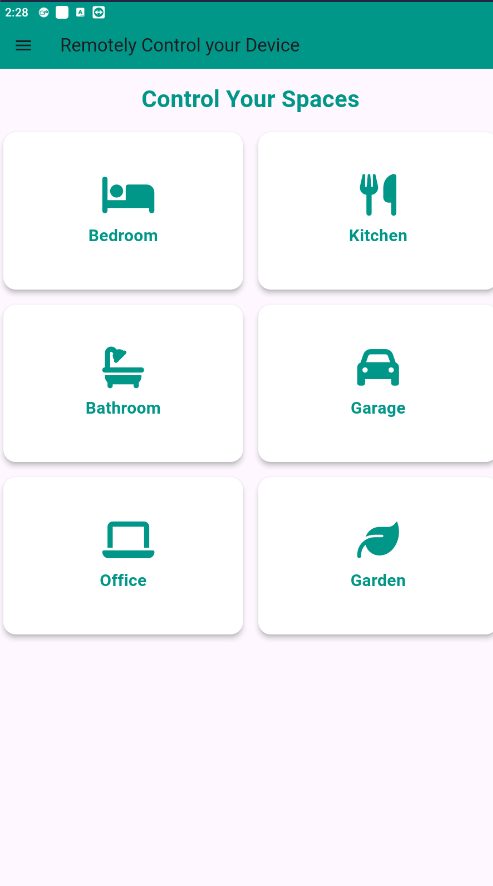
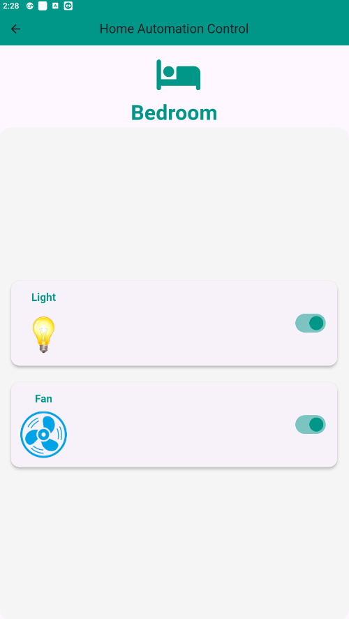
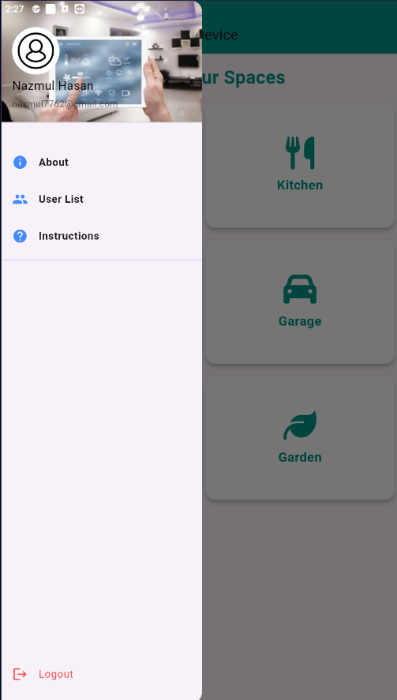

# Home Automation System using Flutter and NodeMCU

## Objective
The primary goal of this project is to build a home automation system that enables users to control household appliances remotely using a mobile application. The system leverages the power of IoT by connecting a NodeMCU microcontroller with Firebase for real-time data management, allowing seamless control through a Flutter-based mobile app.

## Overview
This home automation system is designed to automate the control of various home devices like lights, fans, or other electrical appliances. Users can switch these devices on or off directly from their smartphones, even when they are not at home. The system relies on wireless communication between the NodeMCU microcontroller (ESP8266) and a Flutter application, with Firebase serving as the backend for real-time communication.

## Key Components
- **NodeMCU (ESP8266):** A Wi-Fi-enabled microcontroller that acts as the core hardware for controlling electrical appliances. It is programmed to receive commands from the mobile application via Firebase and to interact with the connected relay module to control appliances.
- **Flutter Mobile Application:** A user-friendly mobile app developed using Flutter, allowing users to monitor and control connected devices. It communicates with the Firebase Realtime Database to send control commands to the NodeMCU.
- **Firebase Realtime Database:** Serves as a cloud-based database that stores the state of the connected devices. It acts as a bridge between the mobile app and the NodeMCU, ensuring that any changes made in the app are instantly reflected in the hardware.
- **Relay Module:** A module that allows the NodeMCU to control high-voltage electrical devices like lights and fans. It acts as a switch that turns appliances on or off based on the commands received from the NodeMCU.

## How the System Works
1. **User Control:** The user opens the mobile app and interacts with switches or toggles to control the appliances (e.g., turning a light on or off).
2. **Real-time Communication:** The app sends a command to Firebase, updating the state of the appliance (on/off). The NodeMCU constantly monitors this database for changes.
3. **Command Execution:** Upon detecting a change in the database, the NodeMCU triggers the corresponding relay, which turns the connected device on or off as per the command from the app.
4. **Feedback to User:** The system can be extended to provide real-time feedback to the user on the current status of devices, ensuring synchronization between the app and physical devices.

## Benefits
- **Remote Control:** Users can control appliances from anywhere, improving convenience and flexibility.
- **Energy Efficiency:** Allows users to monitor and control their appliances, helping to reduce energy consumption by ensuring that devices are only active when needed.
- **Scalability:** The system can be easily scaled by adding more NodeMCU modules or appliances.
- **Customizability:** With the use of Flutter, the app interface can be tailored to specific user preferences, and additional features like scheduling can be implemented.

## Applications
- **Residential Automation:** Controlling lights, fans, air conditioners, and other household appliances remotely.
- **Office Spaces:** Automating the control of electrical equipment like projectors, lights, or security systems.
- **Healthcare:** Managing devices like temperature control systems or remote monitoring tools in hospitals or elder care.

## Circuit Board

## App Screenshots
Here are some screenshots of the application:

### 1. Home Screen

### 3. Menu Page

### 2. Login Page

### 2. Register Page

